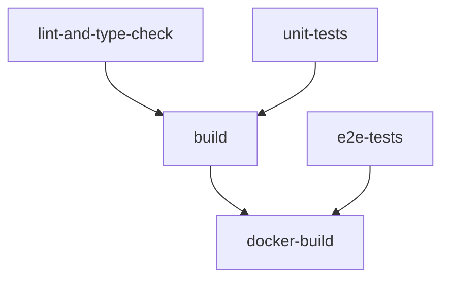

# CI/CD Setup - HealthyMeal

## Przegląd

Minimalny setup CI/CD dla aplikacji HealthyMeal, który zapewnia:
- **Automatyczne testowanie** kodu przy każdym push/PR
- **Budowanie aplikacji** w wersji produkcyjnej
- **Tworzenie obrazu Docker** gotowego do deployment na DigitalOcean
- **Możliwość manualnego uruchamiania** workflow

## Workflow Struktura

### Triggery
- ✅ **Push do master branch** - automatyczne uruchomienie
- ✅ **Pull Request** do master - walidacja zmian
- ✅ **Manual dispatch** - manualne uruchomienie przez GitHub UI

### Jobs Pipeline



#### 1. **Lint & Type Check**
- ESLint sprawdzanie jakości kodu
- TypeScript sprawdzanie typów
- Astro check

#### 2. **Unit Tests**
- Vitest testy jednostkowe
- React Testing Library testy komponentów
- Generowanie raportu coverage

#### 3. **E2E Tests**
- Playwright testy end-to-end
- Uruchamiane na zbudowanej aplikacji
- Multi-browser testing

#### 4. **Build Application**
- Budowanie aplikacji Astro
- Przygotowywanie statycznych plików
- Upload artefaktów build

#### 5. **Docker Build** *(tylko na master)*
- Multi-stage Docker build
- Optymalizacja rozmiaru obrazu
- Cache dla przyspieszenia kolejnych buildów

## Konfiguracja

### GitHub Secrets (opcjonalne dla przyszłych rozszerzeń)
```bash
# Dla deployment na DigitalOcean
DIGITALOCEAN_ACCESS_TOKEN    # Token do DigitalOcean API
DOCKER_REGISTRY_URL          # URL rejestru Docker
DOCKER_REGISTRY_USERNAME     # Username do rejestru
DOCKER_REGISTRY_PASSWORD     # Password do rejestru
```

### Environment Variables
- `NODE_VERSION: '20'` - wersja Node.js
- `CI: true` - flaga środowiska CI

## Uruchamianie

### Automatyczne
- Push do `master` branch
- Utworzenie Pull Request do `master`

### Manualne
1. Idź do **Actions** tab w GitHub
2. Wybierz **CI/CD Pipeline**
3. Kliknij **Run workflow**
4. Wybierz branch i uruchom

## Artefakty

Pipeline generuje następujące artefakty:
- 📊 **Coverage Report** - raport pokrycia testami
- 🏗️ **Build Dist** - zbudowane pliki aplikacji
- 🐳 **Docker Image** - gotowy obraz Docker
- 📋 **Playwright Report** - raporty testów E2E (przy błędach)

## Pliki

```
.github/workflows/ci-cd.yml    # Główny workflow
Dockerfile                     # Multi-stage Docker build
.dockerignore                 # Optymalizacja Docker context
```

## Dockerfile

Multi-stage build zoptymalizowany pod:
- **Bezpieczeństwo** - uruchomienie jako non-root user
- **Wydajność** - layer caching i minimalizacja rozmiaru
- **Production** - tylko potrzebne dependencies

### Etapy budowania:
1. **deps** - instalacja production dependencies
2. **builder** - budowanie aplikacji
3. **runner** - finalny obraz z aplikacją

## Lokalne testowanie Docker

```bash
# Budowanie lokalnie
docker build -t healthymeal:local .

# Uruchomienie
docker run -p 3000:3000 healthymeal:local
```

## Rozszerzenia

Setup można łatwo rozszerzyć o:
- 🚀 **Automatyczny deployment** do DigitalOcean
- 📊 **SonarCloud** integrację dla jakości kodu
- 🔒 **Security scanning** obrazów Docker
- 📱 **Slack/Discord** notyfikacje
- 🏷️ **Semantic release** z tagowaniem

## Monitoring

Workflow monitoruje:
- ✅ Jakość kodu (ESLint, TypeScript)
- ✅ Pokrycie testami jednostkowymi
- ✅ Funkcjonalność E2E
- ✅ Build success w środowisku produkcyjnym
- ✅ Tworzenie obrazu Docker

## Troubleshooting

### Błędy E2E testów
- Sprawdź logi aplikacji w job "E2E Tests"
- Pobierz Playwright report z artefaktów

### Błędy Docker build
- Sprawdź czy wszystkie pliki są poprawnie skopiowane
- Zweryfikuj konfigurację Astro dla SSR/static

### Błędy dependencies
- Upewnij się że `package-lock.json` jest zaktualizowany
- Sprawdź kompatybilność wersji Node.js 